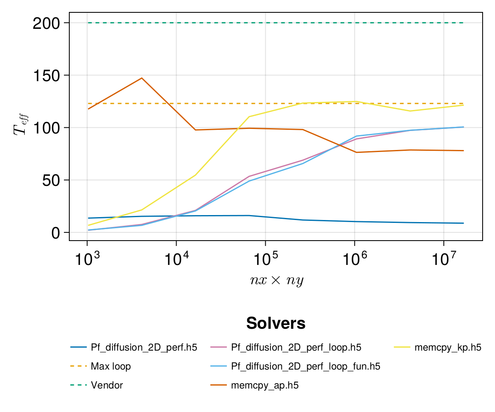

# Julia

This repository contains a divers set of algorithms written in the Julia language.
The developed programs showcase different types like tuples, sets or functions, partial differential equation solvers for multidimensional problems, as well as scaling benchmarks, and unit testing.

## Types
A basic example of a function that calculates the sum of numbers in Julia can be programmed as
```
function summit(args...)
    sum = 0
    for a in args
        sum += a 
    end

    return sum
end
println(summit(1,2))
```
This code snippet can be copied and executed in a Julia REPL. More examples can be found in -> [Types](BasicScripts/types).

## Calculate the acoustic pressure
This algorithm solves the acoustic wave propagation in a 1D domain -> [Acoustic wave](BasicScripts/ETHZ_MasterClass_SolvingPDEsInParallelOnGPUs/lecture2/src/FD_1D_acousticWave.jl).

## Steady-state diffusion solver

Solving the coupled 1D reaction-diffusion equation to a steady-state using an implicit pseudo time iteration scheme ->
[Steady-state reaction diffusion](BasicScripts/ETHZ_MasterClass_SolvingPDEsInParallelOnGPUs/lecture3/src/FD_1D_implicitSteadyDiffusionReaction.jl).
The image below shows the result of a steady-state diffusion simulation as well as the residual convergence.


## Porous convection 2D
Two codes have been developed treating the time integration of temperature either [explicitly](BasicScripts/ETHZ_MasterClass_SolvingPDEsInParallelOnGPUs/lecture4/src/FD_2D_porousConvectionExplicitTemperature_BConFluxes.jl) or [implicitly](BasicScripts/ETHZ_MasterClass_SolvingPDEsInParallelOnGPUs/lecture4/src/FD_2D_porousConvection_implicit_BConFluxes.jl).

The movie below shows the simulation of convection in a porous medium in 2D. A thermal anomaly is emplaced in the center of the domain to kickstart convection. The system is heated from below and cooled from above to maintain convection over time. Boundary conditions are implemented on the fluxes, i.e. directly on the model boundary.

https://github.com/lcandiot/Julia/assets/50524459/99eacfac-ed2f-4c3d-a9b4-60debb29b52b

## Scaling benchmark
### Description
Different implementations of a Darcy equation solver have been developed. These include an optimized Julia [array programming](BasicScripts/ETHZ_MasterClass_SolvingPDEsInParallelOnGPUs/lecture5/src/l5_Pf_diffusion_2D_perf.jl) version in which all division operations of flux calculations and pressure update have been replaced by inverse multiplications. Based on this implementation, another version has been developed. There the flux calculations and pressure update are executed using [loops](BasicScripts/ETHZ_MasterClass_SolvingPDEsInParallelOnGPUs/lecture5/src/l5_Pf_diffusion_2D_perf_loop.jl). Julia is already optimized for loops and thus an increase in performance compared to array programming is expected. Finally, the flux calculations and the pressure update have been wrapped into [kernels](BasicScripts/ETHZ_MasterClass_SolvingPDEsInParallelOnGPUs/lecture5/src/l5_Pf_diffusion_2D_perf_loop_fun.jl). Multi-threading has been activated for the loop versions and simulations were performed on 10 Julia Threads. The [Julia BenchmarkTools](https://juliaci.github.io/BenchmarkTools.jl/stable/) have been used for evaluation and the benchmark has been performed on an Apple Silicon M1 Pro chip (2021). For comparison, results are evaluated against memory copying operations (both for array and kernel programming). Memory copying is measured by taking the elapsed time for computation manually. The figure below shows the benchmark results.  





### Results
Of all tested solver implementations, kernel programming achieves results in the least amount of computing time and at the highest bandwidth (ca. 100 GB/s). Peak bandwidth for memory copying on this machine is predicted at 123 GB/s, which is almost only half of the vendor announced limit of 200 GB/s. Reasons for this discrepancy could be that the vendor limit is only reached for GPU applications. Further testing is required to verify this hypothesis.

## Unit testing
A unit test has been conducted using the [kernel solver](BasicScripts/ETHZ_MasterClass_SolvingPDEsInParallelOnGPUs/lecture5/src/l5_Pf_diffusion_2D_perf_loop_fun.jl) implementation. At three different locations within the domain the pressure values are extracted and compared against reference values at different resolutions. The test is passed for all resolutions (see code output below).

```Test Summary: | Pass  Total  Time
Pf test set   |    1      1  0.0s
Test Summary: | Pass  Total  Time
Pf test set   |    1      1  0.0s
Test Summary: | Pass  Total  Time
Pf test set   |    1      1  0.0s
Test Summary: | Pass  Total  Time
Pf test set   |    1      1  0.0s
```
